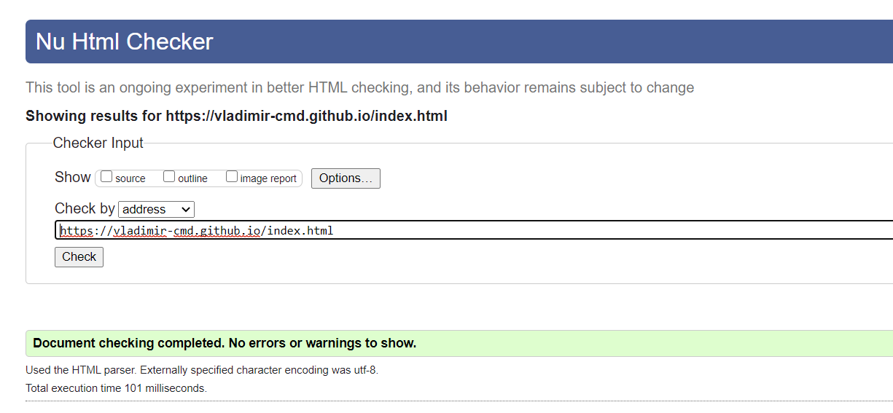
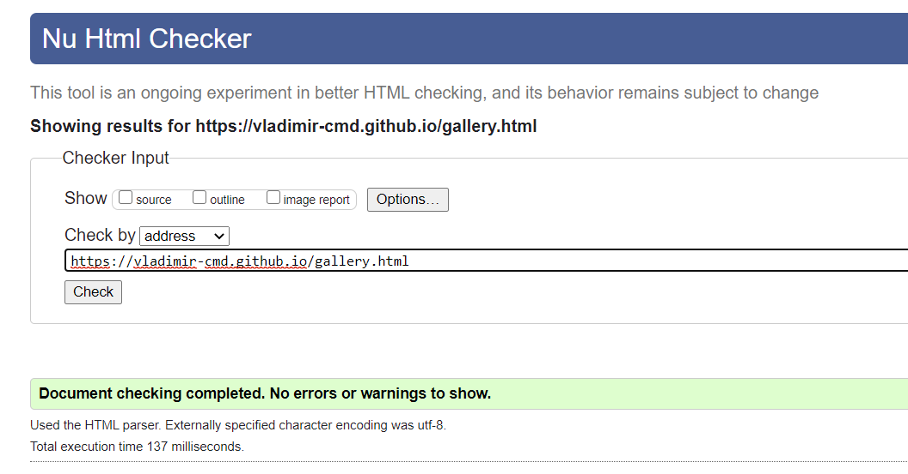

# 
Testing for [Delicious Food](https://vladimir-cmd.github.io/)

Used [W3C HTML validator](https://validator.w3.org/#validate_by_input) website via the direct input path. 

1. Index.html validator results.

2. gallery.html validator results.

## User stories:

- As a visitor, I want an easy way to navigate a website.

  - Visitor goes to the website and on all the pages, there is a simple navigation bar fixed on the top of the page. 
  
  - Wherever a visitor scroll down, on each page the navigation menu bar is there for them to click and go to another page if desired. 

- As a visitor, I want to be able to use it on desktop, tablet and mobile devices.

  - Visitors who are browsing with Chrome, Safari, Firefox and IE can use the website on desktop, tablet and mobile views with full responsiveness.

- As a visitor, I want to find out about tasty food, delicious cuisines and awesome recipes. Also, a visitor might want to find out more about healthy eating.

  - Go to the home page and scroll down to the section 'Delicious Food - Everyday - All day’ 
  
  - There are two sections each introducing a different reasons why eating healthy is good.

- As a visitor, one might want to find out about worlds various cuisines.

  - Go to the home page and scroll down to the ‘Cuisines’ section where there are three columns introducing some of the world's best cuisines.
  
  - There is a 'Read More...' button when if clicked on it, visitor will be taken to a page dedicated to that cuisine.

- As a visitor, I would like to subscribe to Delicious Food latest news.

  - Go to the bottom of the home page by scrolling down and there is a green form labelled ‘Subscribe to our newsletter’.

  - If a visitor clicks on the ‘Subscribe!’ button without filling in the email address, it will indicate with a message to ‘Please fill in this field’ indicating the area to type into.

  - If the field has been filled in but with an invalid email address and you click the ‘Subscribe’ Button then another message comes up ‘Please include a ‘@‘ in the email address ‘___’ is missing a ‘@‘.

# Responsiveness of website

## [Home.html](https://vladimir-cmd.github.io/index.html) in Desktop view.
In desktop mode, the navigation menu bar on the top is fixed and the words are clearly displayed. The screen shows the hero image displaying the full width of the browser.

The site description section contains left panel with reasons why to eat healthy. Center panel contains a nice image of cookies, and the right panel also contains some reasons why to eat healthy.

The Cuisines section contains three columns with two horizontal rows, where we have a short sumary of world's best cuisines. There is a 'Read More...' button, which when clicked on, it will take you to a page dedicated to that cuisine.

Further down there is a table with the list of top 5 recipes of the month.

Next is the Subscribe to our newsletter section.

At the end of the page we have a social network section, where we have icons with links to most popular social networking sites: Facebook, Twitter, Youtube, and Reddit.

## [Home.html](https://vladimir-cmd.github.io/index.html) in iPad/iPad Pro view.

In iPad/iPad Pro mode, the navigation menu bar on the top is fixed and the words are clearly displayed. The screen shows the hero image displaying the full width of the browser.

The site description section contains just one vertical section where we have reasons why to eat healthy, following with the nice image of cookies.

The Cuisines section contains three columns with two horizontal rows, where we have a short sumary of world's best cuisines. There is a 'Read More...' button, which when clicked on, it will take you to a page dedicated to that cuisine.

Further down there is a table with the list of top 5 recipes of the month.

Next is the Subscribe to our newsletter section.

At the end of the page we have a social network section, where we have icons with links to most popular social networking sites: Facebook, Twitter, Youtube, and Reddit.

## [Home.html](https://vladimir-cmd.github.io/index.html) in iPhone X, 5, 6, 7, 8 view.

In mobile mode, the navigation menu bar on the top is fixed and the word are hidden under a button. When you click on a button, it will show the expanded dropdown list, from where you will be able to select the page you like.

The screen shows the hero image displaying the full width of the browser.

The site description section contains just one vertical section where we have reasons why to eat healthy. Image of the cookies is hidden for smaller screens.

The Cuisines section contain only one column, where we have a short sumary of world's best cuisines. There is a 'Read More...' button, which when clicked on, it will take you to a page dedicated to that cuisine.

Table is hidden in mobile view.

Next is the Subscribe to our newsletter section.

At the end of the page we have a social network section, where we have icons with links to most popular social networking sites: Facebook, Twitter, Youtube, and Reddit.

## [gallery.html](https://vladimir-cmd.github.io/gallery.html) in Desktop view.

In desktop mode, the navigation menu bar on the top is fixed and the words are clearly displayed. The screen shows the hero image displaying the full width of the browser.

The Gallery section contains three columns where images are listed. Each image contains a title and a little description.

Next is the Subscribe to our newsletter section.

At the end of the page we have a social network section, where we have icons with links to most popular social networking sites: Facebook, Twitter, Youtube, and Reddit.

## [gallery.html](https://vladimir-cmd.github.io/gallery.html) in iPad/iPad Pro view.

In iPad/Ipad Pro mode, the navigation menu bar on the top is fixed and the words are clearly displayed. The screen shows the hero image displaying the full width of the browser.

The Gallery section contains two columns where images are listed. Each image contains a title and a little description.

Next is the Subscribe to our newsletter section.

At the end of the page we have a social network section, where we have icons with links to most popular social networking sites: Facebook, Twitter, Youtube, and Reddit.

## [gallery.html](https://vladimir-cmd.github.io/gallery.html) in iPhone X, 5, 6, 7, 8 view.

In mobile mode, the navigation menu bar on the top is fixed and the word are hidden under a button. When you click on a button, it will show the expanded dropdown list, from where you will be able to select the page you like.

The Gallery section contains just one column where images are listed. Each image contains a title and a little description.

Next is the Subscribe to our newsletter section.

At the end of the page we have a social network section, where we have icons with links to most popular social networking sites: Facebook, Twitter, Youtube, and Reddit.

## [contact_me.html](https://vladimir-cmd.github.io/contact_me.html) in desktop view.

In desktop mode, the navigation menu bar on the top is fixed and the words are clearly displayed. The screen shows the hero image displaying the full width of the browser.

The form is centred on the page. All the text and text box areas are equally spaced and within the border of the form.

When user selects a text area, field is changed to a thin orange color.

If the ‘Your Name’ field is not filled and user clicks 'Send' then the message ‘Please fill in this field’ appears.

If the ‘Email Address’ field is not filled and user clicks 'Send' then the message ‘Please fill in this field’ appears.

If the ‘Email Address’ field is not valid and you click the ‘Send’ button then the message ‘Please include a ‘@‘ in the email address ‘___’ is missing a ‘@‘ appears.

If the ‘Email Address’ field has been partly filled in with half the email address and you click the ‘Submit’ Button then another message comes up ’Please enter a part following ‘@‘, ‘___@‘ is incomplete’.

When you click the ‘Send’ button it goes into a purple color.

The horizontal divider and social links are centred at the bottom of the page. The social media links are equally spaced and in a row. All links open into a new tab to the external website.

## [contact_me.html](https://vladimir-cmd.github.io/contact_me.html) in iPad/iPad Pro view.

In iPad/iPad Pro, the navigation menu bar on the top is fixed and the words are clearly displayed. The screen shows the hero image displaying the full width of the browser.

The form is centred on the page. All the text and text box areas are equally spaced and within the border of the form.

When user selects a text area, field is changed to a thin orange color.

If the ‘Your Name’ field is not filled and user clicks 'Send' then the message ‘Please fill in this field’ appears.

If the ‘Email Address’ field is not filled and user clicks 'Send' then the message ‘Please fill in this field’ appears.

If the ‘Email Address’ field is not valid and you click the ‘Send’ button then the message ‘Please include a ‘@‘ in the email address ‘___’ is missing a ‘@‘ appears.

If the ‘Email Address’ field has been partly filled in with half the email address and you click the ‘Submit’ Button then another message comes up ’Please enter a part following ‘@‘, ‘___@‘ is incomplete’.

When you click the ‘Send’ button it goes into a purple color.

The horizontal divider and social links are centred at the bottom of the page. The social media links are equally spaced and in a row. All links open into a new tab to the external website.

## [contact_me.html](https://vladimir-cmd.github.io/contact_me.html) in iPhone X, 5, 6, 7, 8 view.

In mobile mode, the navigation menu bar on the top is fixed and the words are clearly displayed. The screen shows the hero image displaying the full width of the browser.

The form is centred on the page. All the text and text box areas are equally spaced and within the border of the form.

When user selects a text area, field is changed to a thin orange color.

If the ‘Your Name’ field is not filled and user clicks 'Send' then the message ‘Please fill in this field’ appears.

If the ‘Email Address’ field is not filled and user clicks 'Send' then the message ‘Please fill in this field’ appears.

If the ‘Email Address’ field is not valid and you click the ‘Send’ button then the message ‘Please include a ‘@‘ in the email address ‘___’ is missing a ‘@‘ appears.

If the ‘Email Address’ field has been partly filled in with half the email address and you click the ‘Submit’ Button then another message comes up ’Please enter a part following ‘@‘, ‘___@‘ is incomplete’.

When you click the ‘Send’ button it goes into a purple color.

The horizontal divider and social links are centred at the bottom of the page. The social media links are equally spaced and in a row. All links open into a new tab to the external website.

# Responsiveness on different browsers:

[Google Chrome](https://google.com) all the testing information has been tested on Chrome browser using DevTools.

[Mozilla Firefox](https://www.mozilla.org/en-GB/firefox/new/) and [Internet Explorer](https://www.microsoft.com/en-gb/download/internet-explorer.aspx) browsers responsiveness is good on desktop, tablet and phone.

[Safari](https://www.apple.com/uk/safari/) browser responsiveness is the same as Chrome browser, no bugs.

## Bugs whilst creating the website:

Navbar code was copied from [Bootstrap 4](https://getbootstrap.com/), I found the dropdown menu wouldn’t work and searched on [CI](https://codeinstitute.net/) slack channel and found I had to change the script order of bootstrap to JS, JQuery, CSS.

I couldn't find a way how to make navigation bar both fixed (goes with scrolling, doesn't disappear), and static at the same time, so when you click on a button in mobile mode, the navbar dropdown pushes the hero image, and not goes over the image.

Used codes from [CSS Tricks](https://css-tricks.com/books/fundamental-css-tactics/scale-typography-screen-size/) to help with font-size responsiveness.

## Bugs to be fixed:

WHen I click on a last photo in gallery, it pushes the Subscribe to our newsletter section further down, thus creating white space.
